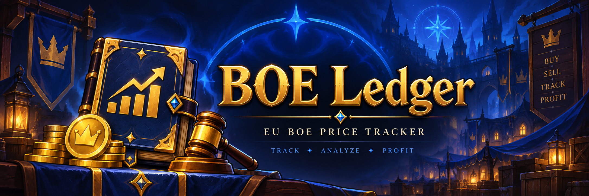

[](https://github.com/ashalogic/boe-ledger/actions/workflows/refresh.yml)
[](https://boe-ledger.ashalogic.workers.dev/)

<p align="center">
  
</p>

# BOE Ledger

Discord bot for tracking selected EU World of Warcraft BOE item prices.

## Features

- Automatic BOE price refresh
- Current prices stored in Cloudflare KV
- Discord commands for price lookup
- Short-term price history
- Curated BOE item list

## Data

Tracked items are defined in:

```text
config/boe-items.json